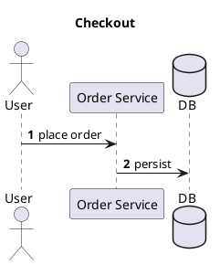

# Cast

> A command-line tool for scaffolding [PlantUML](https://plantuml.com/) sequence diagrams.

[](https://dotnet.microsoft.com/)
[](https://www.nuget.org/packages/Cast.Cli/)
[](LICENSE)

Cast turns command-line participants and messages into a PlantUML sequence diagram starter.

## Requirements

- [.NET SDK 8.0](https://dotnet.microsoft.com/download) or later (the tool targets `net8.0` and runs on the .NET 8 runtime and later)

## Build And Test

```pwsh
git clone https://github.com/QuinntyneBrown/Cast.git
cd Cast
dotnet build Cast.sln
dotnet test Cast.sln
```

## Run From Source

Use `dotnet run --project src/Cast.Cli --` followed by a Cast command:

```pwsh
dotnet run --project src/Cast.Cli -- generate `
  -p actor:User `
  -p "OS:Order Service" `
  -p database:DB `
  -m "User -> OS : place order" `
  -m "OS -> DB : persist" `
  --title "Checkout" `
  --autonumber
```

Output:



## Commands

### `generate`

Scaffolds a PlantUML sequence diagram from participants and optional messages.

| Option | Description |
| --- | --- |
| `-p, --participant <spec>` | Required, repeatable. Participant spec: `[kind:]alias[:Display Name]`. |
| `-m, --message <spec>` | Repeatable. Message spec: `Source -> Target : label`. |
| `-t, --title <text>` | Adds a PlantUML `title`. |
| `--autonumber` | Adds PlantUML `autonumber`. |
| `--theme <name>` | Adds PlantUML `!theme <name>`. |
| `-o, --output <file>` | Writes to a file instead of standard output. |
| `--force` | Overwrites an existing output file. |
| `--no-sample` | Disables placeholder messages when no `--message` values are supplied. |

Participant examples:

```text
User
actor:Customer
database:DB:Main Database
```

Message examples:

```text
User -> OS : place order
OS --> User : confirmation
```

When participants are supplied without messages, Cast generates a placeholder request/response flow
unless `--no-sample` is used.

### `kinds`

Lists supported participant kind prefixes:

```pwsh
dotnet run --project src/Cast.Cli -- kinds
```

Supported kinds are `participant`, `actor`, `boundary`, `control`, `entity`, `database`,
`collections`, and `queue`.

## Exit Codes

| Code | Meaning |
| --- | --- |
| `0` | Success |
| `1` | Usage error, such as malformed input or an unknown message endpoint |
| `2` | I/O error, such as an existing output file without `--force` |

## Project Layout

| Path | Description |
| --- | --- |
| `src/Cast.Cli/` | CLI commands, hosting, models, diagnostics, and services |
| `tests/Cast.Cli.Tests/` | xUnit tests |

## License

Distributed under the MIT License. See [LICENSE](LICENSE) for details.
