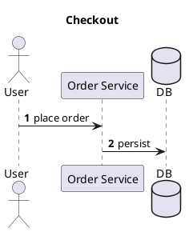

# Cast

> A command-line tool for scaffolding [PlantUML](https://plantuml.com/) sequence diagrams.

[](https://dotnet.microsoft.com/)
[](https://github.com/quinntyne/cast/actions)
[](LICENSE)

Cast generates PlantUML sequence diagram scaffolding from the command line, so you can
go from an idea to a well-structured `.puml` diagram without hand-writing boilerplate.

> [!NOTE]
> Cast is young and the CLI surface may still change before the first tagged release.

## Requirements

- [.NET SDK 10.0](https://dotnet.microsoft.com/download) or later

## Getting started

Clone the repository and build:

```pwsh
git clone https://github.com/quinntyne/cast.git
cd cast
dotnet build
```

Run the CLI:

```pwsh
dotnet run --project src/Cast.Cli -- generate -p actor:User -p OS -m "User -> OS : place order"
```

## Usage

### `cast generate` (alias `gen`)

Scaffold a sequence diagram from participants and (optionally) messages:

```pwsh
cast generate `
  -p actor:User `
  -p "OS:Order Service" `
  -p database:DB `
  -m "User -> OS : place order" `
  -m "OS -> DB : persist" `
  --title "Checkout" --autonumber
```



| Option | Description |
| --- | --- |
| `-p, --participant <spec>` | **Required, repeatable.** A participant: `[kind:]alias[:Display Name]`. |
| `-m, --message <spec>` | Repeatable. A message: `Source -> Target : label`. |
| `-t, --title <text>` | Diagram title. |
| `--autonumber` | Emit `autonumber` so PlantUML numbers each message. |
| `--theme <name>` | Emit `!theme <name>`. |
| `-o, --output <file>` | Write to a file instead of standard output. |
| `--force` | Overwrite an existing output file. |
| `--no-sample` | When no `--message` is given, do **not** generate a placeholder flow. |

If you give participants but no messages, `cast` fills in a placeholder call/return flow
(`TODO: …` labels) so the result is an editable starting point. The diagram goes to standard
output (or `--output`); logs go to standard error, so `cast generate … > diagram.puml` produces
clean PlantUML.

### `cast kinds` (alias `list-kinds`)

List the participant kinds usable as the optional `kind:` prefix: `participant` (default),
`actor`, `boundary`, `control`, `entity`, `database`, `collections`, `queue`.

### Spec formats

A **participant** is `[kind:]alias[:Display Name]` — e.g. `User`, `actor:Customer`, or
`database:DB:Main Database`. The alias must be a valid identifier; quote any spec whose display
name contains spaces (`-p "OS:Order Service"`). A **message** is `Source -> Target : label`; the
arrow may be any PlantUML sequence arrow (`->`, `-->`, `->>`, …), the label is optional, and both
endpoints must be declared participants.

### Exit codes

`0` success · `1` usage error (bad spec, duplicate alias, unknown endpoint, missing required
option) · `2` I/O error (output file exists without `--force`).

## Development

```pwsh
dotnet build                              # build all projects
dotnet run --project src/Cast.Cli         # run the CLI
dotnet test                               # run the test suite
```

Run a single test:

```pwsh
dotnet test --filter "FullyQualifiedName~Cast.Cli.Tests.ParticipantParserTests"
```

### Project layout

| Path | Description |
| --- | --- |
| `src/Cast.Cli/Program.cs` | Composition root — builds the DI container and invokes the root command |
| `src/Cast.Cli/Hosting/` | DI registration (`AddCast`), `RootCommandFactory`, exit codes |
| `src/Cast.Cli/Commands/` | One `ICliCommand` per file (`GenerateCommand`, `ListKindsCommand`) |
| `src/Cast.Cli/Services/` | Interface-backed services: parsers, sample flow, renderer, writer, orchestrator |
| `src/Cast.Cli/Models/` | Immutable diagram records |
| `tests/Cast.Cli.Tests/` | xUnit test project |

The codebase targets **.NET 10** with nullable reference types and implicit usings enabled, and
follows SOLID principles: each service is small and single-purpose, depends only on interfaces,
and is registered in one place (`AddCast`). Rendering sits behind `ISequenceDiagramRenderer`, so a
new output format — or a new command — is an additive change.

## Contributing

Contributions are welcome. To propose a change:

1. Fork the repository and create a feature branch.
2. Make your change, keeping it covered by tests (`dotnet test`).
3. Open a pull request describing the motivation and approach.

Please keep pull requests focused and ensure the build and tests pass before submitting.

## License

Distributed under the MIT License. See [`LICENSE`](LICENSE) for details.
