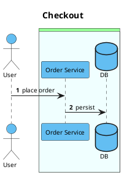
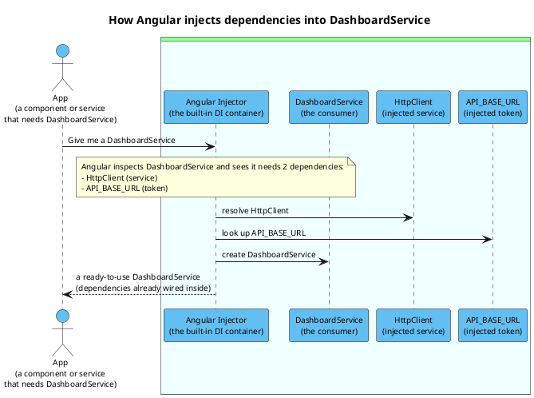

# Cast

> A command-line tool for scaffolding [PlantUML](https://plantuml.com/) sequence diagrams.

[](https://dotnet.microsoft.com/)
[](https://www.nuget.org/packages/Cast.Cli/)
[](LICENSE)

Cast turns command-line participants and messages into a PlantUML sequence diagram starter.

## Requirements

- [.NET SDK 8.0](https://dotnet.microsoft.com/download) or later (the tool targets `net8.0` and runs on the .NET 8 runtime and later)

## Install From NuGet

Install the latest published `Cast.Cli` tool package from NuGet:

```pwsh
dotnet tool install --global Cast.Cli
```

Or pin the currently published latest version:

```pwsh
dotnet tool install --global Cast.Cli --version 1.2.18
```

After installation, run Cast with the `cast` command:

```pwsh
cast --help
cast generate -p actor:User -p OS -m "User -> OS : place order"
cast ng --service projects/api/src/lib/services/dashboard.service.ts
cast template save --name acme-ordering -p actor:User -p OS
cast template --name acme-ordering -m "User -> OS : place order"
```

Update an existing global install:

```pwsh
dotnet tool update --global Cast.Cli
```

For a repository-local tool install:

```pwsh
dotnet new tool-manifest
dotnet tool install Cast.Cli
dotnet tool run cast -- --help
```

## Build And Test

```pwsh
git clone https://github.com/QuinntyneBrown/Cast.git
cd Cast
dotnet build Cast.sln
dotnet test Cast.sln
```

## Run From Source

Use `dotnet run --project src/Cast.Cli --` followed by a Cast command:

```pwsh
dotnet run --project src/Cast.Cli -- generate `
  -p actor:User `
  -p "OS:Order Service" `
  -p database:DB `
  -m "User -> OS : place order" `
  -m "OS -> DB : persist" `
  --title "Checkout" `
  --autonumber `
  --stdout
```

By default the diagram is written to `cast.puml` in the current directory; pass `--stdout` to
print it to standard output instead, or `-o <file>` to choose another path. On Windows, every
command that writes a `.puml` file opens it in Notepad right away — pass `--no-open` to skip that.

Output:



Every diagram runs the [teoz](https://plantuml.com/teoz) engine with a default font size of 10,
every participant and actor is colored `#63BEF2`, and the non-actor participants are wrapped in a
double nested box — outer `#PHYSICAL`, inner `#AZURE` by default. Actors always stay outside the
boxes. Override the box colors with `--outer-box-color` and `--inner-box-color` (a missing `#`
prefix is added automatically); the participant color is fixed.

## Commands

### `generate`

Scaffolds a PlantUML sequence diagram from participants and optional messages.

| Option | Description |
| --- | --- |
| `-p, --participant <spec>` | Required, repeatable. Participant spec: `[kind:]alias[:Display Name]`. |
| `-m, --message <spec>` | Repeatable. Message spec: `Source -> Target : label`. |
| `-t, --title <text>` | Adds a PlantUML `title`. |
| `--autonumber` | Adds PlantUML `autonumber`. |
| `--theme <name>` | Adds PlantUML `!theme <name>`. |
| `-o, --output <file>` | Write to this file. Defaults to `cast.puml` in the current directory. |
| `--stdout` | Write to standard output instead of a file (takes precedence over `--output`). |
| `--force` | Overwrites an existing output file. |
| `--no-sample` | Disables placeholder messages when no `--message` values are supplied. |
| `--outer-box-color <color>` | Color of the outer box wrapping the non-actor participants. Defaults to `#PHYSICAL`. |
| `--inner-box-color <color>` | Color of the inner box wrapping the non-actor participants. Defaults to `#AZURE`. |
| `--no-open` | Do not open the written file in Notepad (Windows only; opening is the default). |

Participant examples:

```text
User
actor:Customer
database:DB:Main Database
```

Message examples:

```text
User -> OS : place order
OS --> User : confirmation
```

When participants are supplied without messages, Cast generates a placeholder request/response flow
unless `--no-sample` is used.

### `kinds`

Lists supported participant kind prefixes:

```pwsh
dotnet run --project src/Cast.Cli -- kinds
```

Supported kinds are `participant`, `actor`, `boundary`, `control`, `entity`, `database`,
`collections`, and `queue`.

### `ng`

Inspects an Angular `.ts` file and emits a PlantUML sequence diagram explaining how Angular's
dependency injector supplies that consumer's dependencies. The consumer can be **any construct that
uses `inject(...)`** — an `@Injectable` service, an `@Component`/`@Directive`/`@Pipe`, a functional
interceptor/guard/resolver, or an exported function (a factory or initializer). It recognises both
idiomatic DI shapes: the `inject(X)` function (in class fields, functional providers, and function
declarations) and classic constructor injection (including `@Inject(TOKEN)` and `@Optional()`).
Symbols written in `SCREAMING_CASE` or injected via `@Inject` are treated as `InjectionToken`s;
PascalCase symbols such as `HttpClient` or `Router` are treated as classes the injector constructs.
Parsing is done in pure .NET — no Node runtime is required.

| Option | Description |
| --- | --- |
| `-s, --service, --file <file>` | Required. Path to the Angular `.ts` file to inspect. |
| `-t, --title <text>` | Override the generated diagram title. |
| `-o, --output <file>` | Write to this file. Defaults to the source path with a `.puml` extension (`foo.service.ts` → `foo.service.puml`). |
| `--stdout` | Write to standard output instead of a file (takes precedence over `--output`). |
| `--force` | Overwrite an existing output file. |
| `--outer-box-color <color>` | Color of the outer box wrapping the non-actor participants. Defaults to `#PHYSICAL`. |
| `--inner-box-color <color>` | Color of the inner box wrapping the non-actor participants. Defaults to `#AZURE`. |
| `--no-open` | Do not open the written file in Notepad (Windows only; opening is the default). |

By default the diagram is written next to the source as a `.puml` file (and opened in Notepad on
Windows); pass `--stdout` to print it to standard output instead.

```pwsh
dotnet run --project src/Cast.Cli -- ng `
  --service projects/api/src/lib/services/dashboard.service.ts
```

For an `@Injectable({ providedIn: 'root' })` service that injects `HttpClient` and the
`API_BASE_URL` token, Cast produces a narrated diagram:



A functional provider (an interceptor, guard, or resolver) is rendered with the "pull" narrative
it actually follows — the function runs inside an injection context and calls `inject(...)` for each
dependency it needs.

### `style`

Applies the default styling to **existing** PlantUML sequence diagrams, in place. Pass a single
`.puml` file, or a folder — every `.puml` file beneath it (recursively) is checked. Each file that
is a sequence diagram gains whichever pieces of the house style it is missing:

- `!pragma teoz true` directly after `@startuml`;
- `skinparam defaultFontSize 10` (placed after any `!theme` so the size still wins);
- the `#63BEF2` participant color on every lifeline declaration that has no color of its own;
- the double nested box around the explicitly declared non-actor participants
  (actors are hoisted above the box and stay outside it).

```pwsh
cast style docs/diagrams                      # restyle every sequence .puml under docs/diagrams
cast style flow.puml --outer-box-color Gray   # single file, custom outer box color
```

| Option | Description |
| --- | --- |
| `path` (argument) | Required. A `.puml` file, or a folder scanned recursively for `.puml` files. |
| `--outer-box-color <color>` | Color of the outer box wrapping the non-actor participants. Defaults to `#PHYSICAL`. |
| `--inner-box-color <color>` | Color of the inner box wrapping the non-actor participants. Defaults to `#AZURE`. |

The command is conservative and idempotent: re-running it changes nothing, non-sequence diagrams
(class, component, state, activity, …) are left byte-for-byte untouched, files that already have a
teoz pragma, a `defaultFontSize` setting, or any `box` keep what they have, a declaration that
already carries a color (or a colored stereotype) keeps it, and when participant declarations are
interleaved with messages or comments the box step backs off rather than reorder the diagram (the
other rules still apply). Files containing multiple `@startuml` blocks are
skipped. Line endings (CRLF/LF), trailing-newline-ness, and the file's encoding (UTF-8 with or
without BOM, UTF-16/32) are all preserved.

### `template`

Saves named diagram templates — the cast of participants you always diagram with — and renders
them on demand. Templates are stored as JSON under your user profile
(`%APPDATA%\cast\templates\<name>.json` on Windows, `~/.config/cast/templates` elsewhere), so they
are available from any directory.

```pwsh
# create (or update — save is an upsert)
cast template save --name acme-ordering -p actor:User -p "OS:Order Service" -p database:DB -m "User -> OS : place order"

# render: writes cast.puml in the current directory and opens it in Notepad
cast template --name acme-ordering

# render with this diagram's specific flow (replaces any stored messages)
cast template --name acme-ordering -m "User -> OS : place order" -m "OS -> DB : persist" --force

# manage
cast template list
cast template show --name acme-ordering
cast template delete --name acme-ordering
```

A template stores the participants (required), optional default messages, and default `--title`,
`--autonumber`, `--theme`, and box-color values. Everything is validated at save time with the same
rules `generate` applies, so a bad template can never be saved. The stored file is plain,
hand-editable JSON — `acme-ordering.json` from the `save` above looks like this:

```json
{
  "name": "acme-ordering",
  "participants": [
    "actor:User",
    "OS:Order Service",
    "database:DB"
  ],
  "messages": [
    "User -> OS : place order"
  ],
  "title": null,
  "autoNumber": false,
  "theme": null,
  "outerBoxColor": null,
  "innerBoxColor": null
}
```

Edits are picked up on the next render; anything malformed is reported with a clear error. Only
`name` and at least one participant are required — the other properties may be omitted entirely.

| Subcommand | Description |
| --- | --- |
| *(none)* | Render the template named by `-n, --name`. Takes the same options as `generate` except `--participant`. |
| `save` | Create or update (upsert) a template. `--name` and repeatable `-p, --participant` are required; `-m`, `--title`, `--autonumber`, `--theme`, and the box colors are optional. |
| `list` | Print the saved template names. |
| `show --name <name>` | Print a template's stored definition as JSON. |
| `delete --name <name>` | Delete a template. |

Render-time options override the stored values: `-m` messages **replace** the stored messages
entirely; `--title`, `--theme`, and the box colors fall back to the stored values when not
supplied; `--autonumber` can only switch numbering on. When neither the template nor the command
line supplies messages, the placeholder flow kicks in exactly like `generate` (suppress it with
`--no-sample`). The rendered diagram lands in `cast.puml` by default — `-o`, `--stdout`, `--force`,
and `--no-open` behave exactly as they do for `generate`.

### `explorer`

Opens the folder where templates are stored in Visual Studio Code (creating the folder first if
no template has been saved yet), so the JSON files are one command away from hand editing:

```pwsh
cast explorer
```

Requires the `code` command on the PATH (in VS Code: *Shell Command: Install 'code' command in
PATH*); a missing `code` command is reported as an error.

## Exit Codes

| Code | Meaning |
| --- | --- |
| `0` | Success |
| `1` | Usage error, such as malformed input or an unknown message endpoint |
| `2` | I/O error, such as an existing output file without `--force` |

## Project Layout

| Path | Description |
| --- | --- |
| `src/Cast.Cli/` | CLI commands, hosting, models, diagnostics, and services |
| `tests/Cast.Cli.Tests/` | xUnit tests |

## License

Distributed under the MIT License. See [LICENSE](LICENSE) for details.
